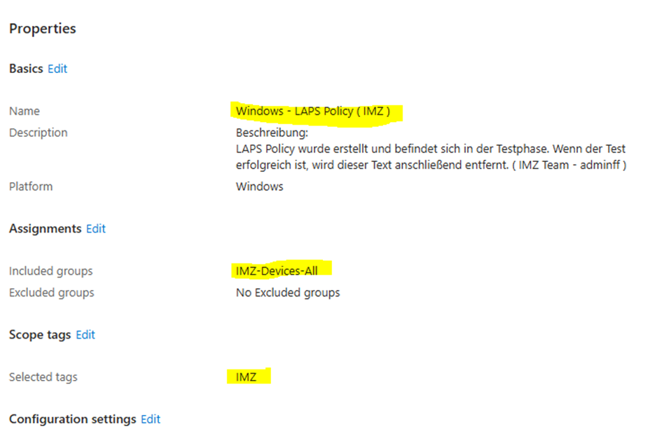
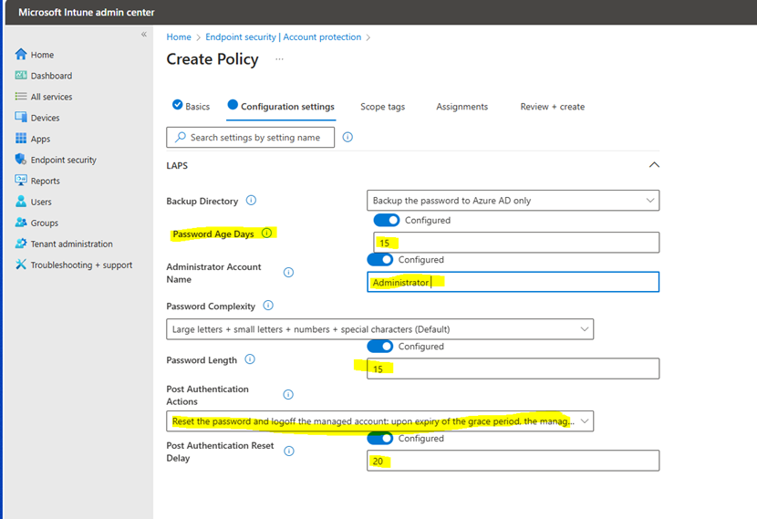
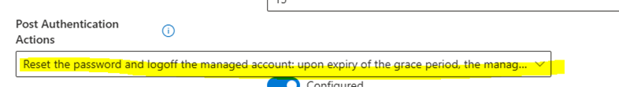

# Windows 11 LAPS mit Intune konfigurieren
## Was ist Windows LAPS?
### LAPS( Local Administrator Password Solution ) ist eine Microsoft Technologie zur Verwaltung lokaler Administratorpasswörter auf Windows Geräten. Mit Intune kann LAPS konfiguriert werden, um die Sicherheit zu erhöhen und zentrale Richtlinien zur Verwaltung von Passwörten umzusetzen.

## 📍Wo können wir LAPS in Intune finden ? 
🔹 **Microsoft Intune admin Center -> Home -> Endpoint Security -> Account protection -> Windows-LAPS Policy (IMZ)** 

## 🛠Meine Schritte zur LAPS-Konfiguration

### 1️⃣ Erstellung der Richtlinie:
- Eine neue **Windows-LAPS-Policy (IMZ)** wurde erstellt. 
### 2️⃣ Definition & Zweck:  
- Eine Beschreibung hinzugefügt, damit alle Nutzer verstehen, warum diese Richtlinie existiert.
### 3️⃣ Zuweisung an Geräte:
- Die Policy wurde der Gruppe **IMZ-Devices-All** zugewiesen, sodass sie auf alle Mitglieder dieser Gruppe angewendet wird.  
## 🖼️ Screenshot der LAPS-Konfiguration

## 🛠Konfiguration Settings:
### 1️⃣ Die Option "Backup Directory" wurde ausgewählt:
#### ( Backup the password to Azure AD only)
### 2️⃣"Password Age Days" wurde auf 15 Tage eingestellt, was bedeutet, dass das Passwort alle 15 Tage geändert werden muss.
📚Password Age Days ist die Dauer, für die ein Passwort gültig bleibt, bevor es geändert werden muss. Diese Einstellung hilft dabei, den Zeitraum zwischen Passwortänderungen festzulegen und die Sicherheit der Konten zu gewährleisten, indem verhindert wird, dass ein Passwort über einen längeren Zeitraum hinweg unverändert bleibt.
### 3️⃣ Administrator Account Name:
#### Der Administrator-Kontoname wurde hier eingetragen, um das Konto zu kennzeichnen, das als Administrator fungiert. In der Regel handelt es sich dabei auf allen Computern um ein Administratorkonto. Der Administrator-Kontoname in Kontext von LAPS in Intune bezieht sich auf den lokalen Administratoraccount, dessen Passwort von LAPS verwaltet und regelmäßig geändert werden soll. Dies kann entweder das integrierte Administrator-Konto oder ein benutzerdefiniertes konto sein.

### 4️⃣ Password Complexity:
#### Es wurde **Large letters + small lettrs + numbers + special characters** eingestellt. 
### 5️⃣ Password Length:
#### Es wurde **15 characters** eingestellt.
## 🖼️ Screenshot Configuration settings

### 6️⃣ Password Authentication Actions:
#### Es wurde **🔸Reset the password and logoff the managed account: upon expiry of the grace period, the managed account password will be reset and any interactive logon sessions using the managed account will terminated.🔸** eingestellt.
## 🖼️ Screenshot

#### 💬 Wenn die Zusatzzeit abläuft und das Passwort nicht geändert wurde, wird das Passwort automatisch zurückgesetzt und der Benutzer wird aus dem System abgemeldet. Alternativ könnte auch eine Benachrichtigung gesendet werden, die den Benutzer auffordert, das Passwort zu ändern, bevor der Zugriff eingeschränkt wird.

### 7️⃣ Post Authentication Rest Delay:
#### Es wurde ** 20 Minuten ** eingestellt.
#### 💬 Der Post Authentication Reset Delay ermöglicht es, eine Verzögerung zwischen dem Ablauf des Passworts und den automatischen Maßnahmen festzulegen. Eine kürzere Verzögerung (z. B. 5 Minuten) erhöht die Sicherheit, während eine längere Verzögerung (z. B. 30 Minuten) den Benutzern mehr Zeit gibt, das Passwort zu aktualisieren, bevor Maßnahmen ergriffen werden.